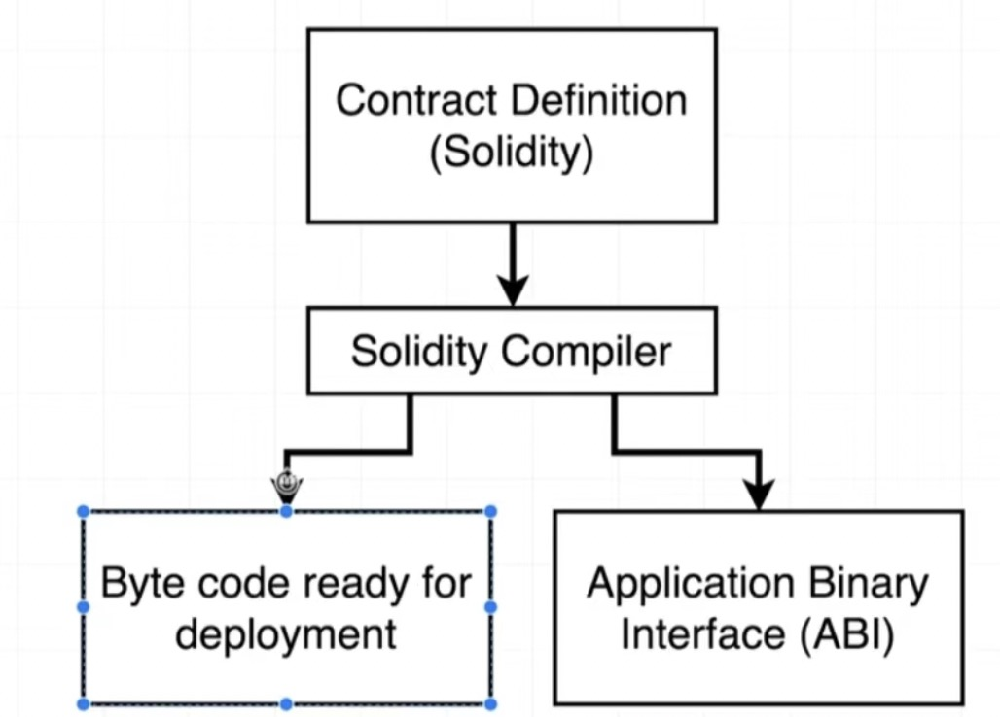
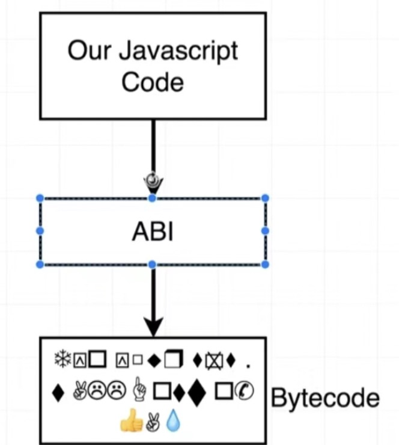

1. 账户： 钱包账户和智能合约账户

    智能合约部署以后，会返回一个合约地址，该合约地址就是合约的账户，亦可以存储资产，比如erc20 代币，nft 等

    常用的比如defi 类产品中的国库合约，存放整个应用中的所有资产

2. 合约账户和钱包账户的不同

    + 合约账户： 部署在特定网络节点上，

        + balance: 拥有资产的数量

        + storage: 存储数据

        + code: 有代码控制
    
    + 外部账户

       + 独立于网络之外

       + account address: 用户地址

       + public key: 公钥

       + private key: 私钥

3. ***solidity 后缀名为.sol***

4. solidity 是强类型语言,支持继承，库和复杂的用户定义的类型

5. solidity 是编写智能合约的语言，但是solidity 语言并不能被网络上直接执行，因此编写好的合约首先需要经过solidity编译器 编译成可以执行的字节码和ABI

    

    + 字节码会被部署到网络上

    + abi: 我们的JavaScript应用程序通过abi 映射到字节码实现交互

       