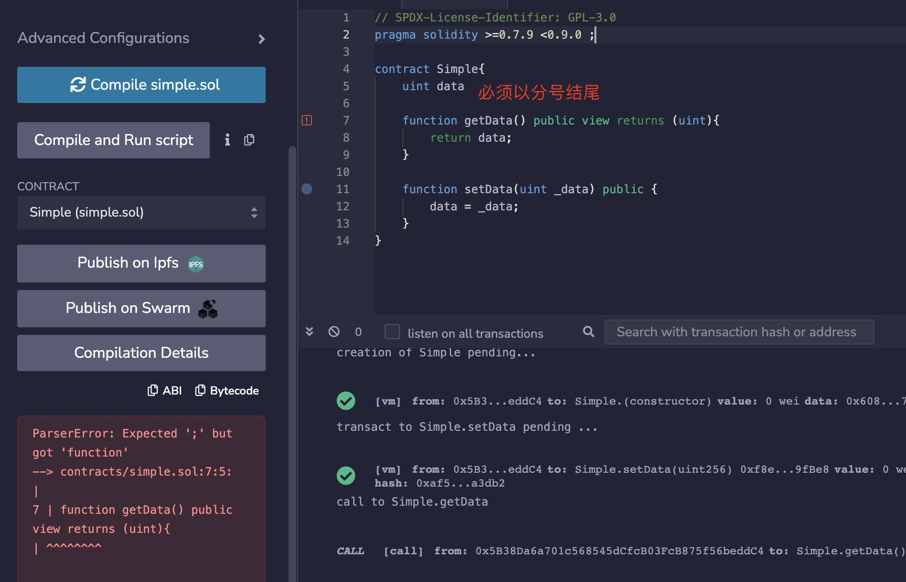
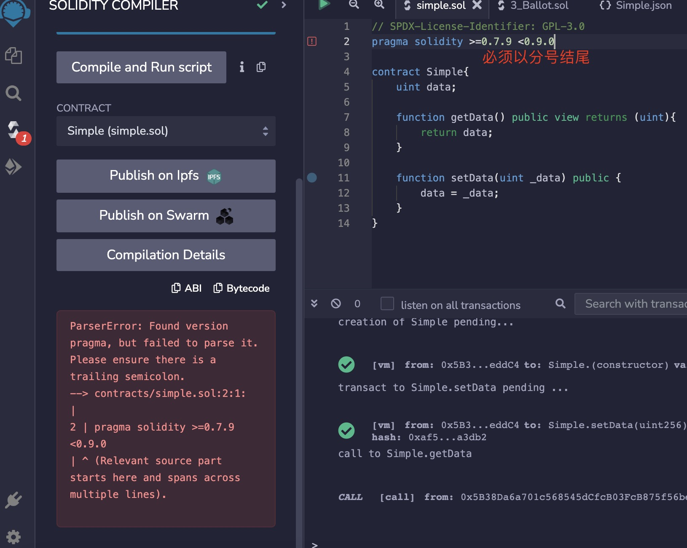

1. 合约文件结构

   + 第一行SPDX 许可标识符，

      如果智能合约的源代码是公开的，就可以更好地建立对智能合约的信任。 由于提供源代码总是涉及到版权方面的法律问题， Solidity 编译器鼓励使用机器可读的 SPDX 许可标识符 。 每个源文件都应该以一个注释开始，表明其许可证

            // SPDX-License-Identifier: MIT

        编译器不会验证许可证是否属于 SPDX许可的列表， 但它确实包括在 字节码元数据（bytecode metadata） 提供的字符串中。

  + pragma : 知道solidity 编译器版本

     因为solidity 版本跟新太快，这里指定编译器版本，避免导致编译器的原因出现的错误

     + pragma solidity 0.8.7;// 表示只能是0.8.7 这个版本

     + pragma solidity ^0.8.7;// 表示大于等于0.8.7 小于0.9.0 ，其他版本不行，

     + pragma solidity >=0.8.7 <0.9.0; 

   + 剩下的一个或多个合约声明

2. solidity 语句完成以后必须以分号结尾，包括pragma 

    

    pragma 指令语句也必须以分号结尾。

    

3. 注释

  + 单行注释： //

  + 多行注释： /**/