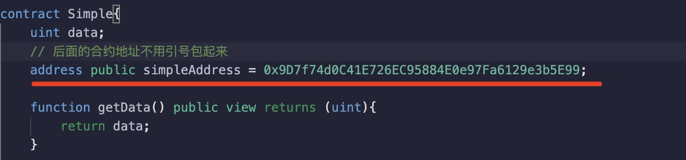

1. solidity 是强类型语言，也就是说无论是状态变量还是局部变量都必须先被声明才能使用。

        string data;

        uint number;

    > solidity 不存在未定义或空的概念，因此新声明的变量总是有一个取决于其类型的 ***默认值***

    定义状态变量时，如果没有赋值，则是各个类型的默认值

    + 赋值

            string data ="hello";

            bytes d ="hello"; // string 是特殊的bytes 类型
    
    + 不复值

            string data;  // 默认值为 ""
            bytes d; // 默认值为0x
            bool b; // 默认值为false

            int/uint 默认为0

2. 值类型：因为这些类型的变量将始终按值来传递。 ***也就是说，当这些变量被用作函数参数或者用在赋值语句中时，总会进行值拷贝***

+ bool: true / false

+ int: 有符号（即有正负之分）位整型，包括int8 到 int256

+ uint: 无符号整型，即全部是正整数，包括uint8 到 uint 256

3. address 和 address payable

+ address: 保存合约地址或者钱包地址

+ address payable： 与 address 类型相同，但有额外的方法 transfer 和 send

   

+ 类型转换：

   允许从 address payable 到 address 的隐式转换， 而从 address 到 address payable 的转换必须通过 payable(< address >) 来明确。

   对于 uint160、整数、 bytes20 和合约类型，允许对 address 进行明确的转换和输出。

   只有 address 类型和合约类型的表达式可以通过 payable(...) 显式转换为 address payable 类型。 对于合约类型，只有在合约可以接收以太的情况下才允许这种转换，也就是说， ***合约要么有一个 receive 函数，要么有一个 payable 类型的 fallback 的函数***。

4. string 类型，变长 UTF-8 编码字符串类型，参见 数组。***并不是值类型！***

    使用双引号或者单引号括起来。

        string a = "hello";

        string b = 'hello';

    >字符串字面常数的类型也可以发生改变， 但它们可以隐式地转换成 bytes1，……， bytes32，如果合适的话，还可以转换成 bytes 以及 string

5. bytes 类型

6. enum 枚举类型

        enum MsgType {
            withdraw,
            deposit
        }

7.  结构体 struct

        struct Message{
            uint code,
            string msg
        }

8. 数组 []

   + 定长数组，即数组长度固定

   + 变长数组

9. mapping(key=>value)

   > mapping[key] 的值如果集合中，则返回改值，如果没有则返回value 类型的默认值