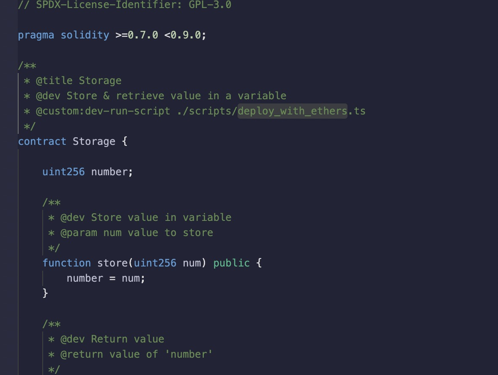
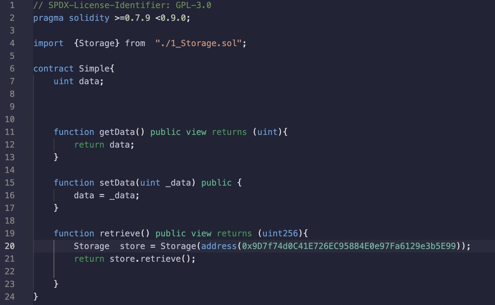

1. Solidity 支持导入语句，以帮助模块化您的代码， 

   ***然而，Solidity 并不支持 默认导出 的概念。***

 + 全局层面

        import "filename";
    
    filename 部分被称为 导入路径。 该语句将所有来自 “filename” 的全局符号（以及在那里导入的符号） 导入到当前的全局范围

    > 缺点：因为它不可预测地污染了命名空间。

        import * as symbolName from "filename";
    
       这意味着所有全局符号以 symbolName.symbol 的格式提供。

 + 命名导入

    如果有命名冲突，您可以在导入的同时重命名符号。 例如，下面的代码创建了新的全局符号 alias 和 symbol2， 它们分别从 "filename" 里面引用 symbol1 和 symbol2。

        import {symbol1 as alias, symbol2} from "filename";

2. 一个sol 文件可以被看做一个模块，导出不需要export ,默认为命名导出

    

    导入上图中的Storage

     

    直接使用命名导入

            import { Storage } from "./1_Storage.sol";

3. 导入路径和es6 一致